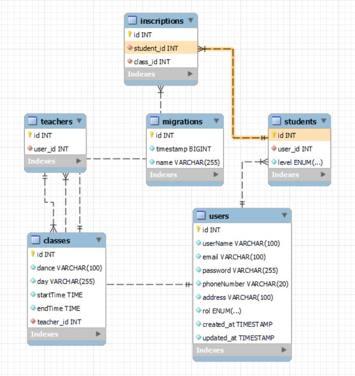

   # Welcome to my backend app

## All4dancing


<details>
  <summary>Contenido 📝</summary>
  <ol>
    <li><a href="#objetivo">Objetivo</a></li>
    <li><a href="#sobre-el-proyecto">Sobre el proyecto</a></li>
    <li><a href="#stack">Stack</a></li>
    <li><a href="#diagrama-bd">Diagrama</a></li>
    <li><a href="#instalación-en-local">Instalación</a></li>
    <li><a href="#endpoints">Endpoints</a></li>
    <li><a href="#futuras-funcionalidades">Futuras funcionalidades</a></li>
    <li><a href="#contribuciones">Contribuciones</a></li>
    <li><a href="#licencia">Licencia</a></li>
    <li><a href="#webgrafia">Webgrafia</a></li>
    <li><a href="#agradecimientos">Agradecimientos</a></li>
    <li><a href="#contacto">Contacto</a></li>
  </ol>
</details>

## Objetivo
Este proyecto requería una API funcional conectada a una base de datos 

## Sobre el proyecto
He decidido crear una  API funcional conectada a la base de datos de una academia de baile. Esta aplicación está orientada al sistema de gestión de clases e inscripciones en tal academia. Se han definido tres roles para la gestión e interacción con la API: "student", "teacher" y "admin", en correspondencia con ellos se podrá acceder a determinadas funcionalidades. Entre las funcionalidades se encuentran las siguientes: registro y login de usuarios, acceso a clases disponibles, inscripción en las clases, los alumnos verán las inscripciones que han realizado, los profesores verán las clases que tienen programadas, el administrador podrá ver todos los usuarios de la base de datos, eliminarlos; podrá crear clases, modificarlas o eliminarlas; todos los usuarios tendrán acceso a su perfil personal y podrán modificar algunos de sus datos.


## Stack
Tecnologías utilizadas:
<div align="center">
<a href="https://www.mysql.com/">
    
</a>
<a href="https://www.expressjs.com/">
    
</a>
<a href="https://nodejs.org/es/">
    
</a>
<a href="https://developer.mozilla.org/es/docs/Web/JavaScript">
    
</a>
 </div>


## Diagrama BD


## Instalación en local
1. Clonar el repositorio
2. ` $ npm install `
3. Conectamos nuestro repositorio con la base de datos 
4. ``` $ Ejecutamos las migraciones ``` 
5. ``` $ npm run dev ``` 


## Endpoints
<details>
<summary>Endpoints</summary>

http://localhost:5000

    - REGISTRAR USUARIO ROL STUDENT

            POST /api/auth/register/student
        body:
        ``` js
   {    
       "userName": "nombreStudent",
       "email": "nombrestudent@email.com",
       "password": "123456",
        "address": "Calle 2",
       "phoneNumber": 456736
    }
        ```
    - REGISTRAR USUARIO ROL TEACHER

            POST /api/auth/register/teacher
        body:
        ``` js
   {    
       "userName": "nombreTeacher",
       "email": "nombreteacher@email.com",
       "password": "123456",
        "address": "Calle 2",
       "phoneNumber": 456736
    }
        ```
    - REGISTRAR USUARIO ROL ADMIN

            POST /api/auth/register/admin
        body:
        ``` js
   {    
       "userName": "nombreAdmin",
       "email": "nombreadmin@email.com",
       "password": "123456",
        "address": "Calle 2",
       "phoneNumber": 456736
    }
        ```

    - LOGIN USUARIOS

            POST /api/auth/login  
        body:
        ``` js
            {
                "email": "esther@email.com",
                "password":"123456"
            }
        ```

        - RECUPERAR TODOS LOS USUARIOS 

            GET /api/users


    - RECUPERAR USUARIO POR ID

            GET /api/users/1   

       
    - EDITAR PERFIL DE USUARIO

            PATCH /api/users/1    
        body:
        ``` js
             {
              "userName" : "Newramiro",
              "email": "newramiro@email.com",  
            }
        ```
    - INSCRIPCIÓN CLASE

            Post /api/inscription    
        body:
        ``` js
               {
    
    "studentId": 1,
    "classId": 2
           
    } 
        ```
    


    - CREACIÓN CLASE

            POST /api/class
        body:
        ``` js
             {
       
               "dance": "salsa",
               "day": "jueves",
               "startTime": "10:00:00",
               "endTime": "11:00:00",
               "teacherId": 1
                  
                  
               }
        ```
    - RECUPERAR INSCRIPCIONES

            GET /api/inscription

   - RECUPERAR INSCRIPCIONES POR ID

            GET /api/inscription/1         

        
    - MODIFICACIÓN DE CLASES

            PATCH /api/class/1
        body:
        ``` js
            {
                
                  "dance": "Salsa",
                  "day": "Lunes",
                  "startTime": "10:00:00",
                  "endTime": "11:00:00",
                  "teacherId": "1"

            }
        ```
     - ELIMINACIÓN DE CLASE

            DELETE /api/class/1

     - ELIMINACIÓN DE USUARIO

            DELETE /api/users/1

     - RECUPERAR CLASES PROFESORES

            GET /api/class/getClassesByTeacher/1  

    - ...
</details>

## Futuras funcionalidades
[ ] Reserva de clases privadas.
[ ] Implementación de recomendador de niveles de clases.
[ ] Postear videos y tutoriales.
[ ] Postear feedbacks.
 

## Contribuciones
Las sugerencias y aportaciones son siempre bienvenidas.  

Puedes hacerlo de dos maneras:

1. Abriendo una issue
2. Crea un fork del repositorio
    - Crea una nueva rama  
        ```
        $ git checkout -b feature/nombreUsuario-mejora
        ```
    - Haz un commit con tus cambios 
        ```
        $ git commit -m 'feat: mejora X cosa'
        ```
    - Haz push a la rama 
        ```
        $ git push origin feature/nombreUsuario-mejora
        ```
    - Abre una solicitud de Pull Request

## Licencia
Este proyecto se encuentra bajo licencia de "Dayanis"

## Webgrafia:
Para conseguir mi objetivo he recopilado información de:
- https://www.npmjs.com/package//typeorm


## Agradecimientos:

Agradezco a mi tutor Aissa, a mis profesores del Bootcamp y a mis compañeros por toda la ayuda en este proyecto:


- *Reynaldo*  
<a href="https://github.com/ReynaldoMunozF/" target="_blank"></a> 

 

## Contacto
<a href = "mailto:garciarodriguezprof@gmail.com"> Email</a>

</p>


